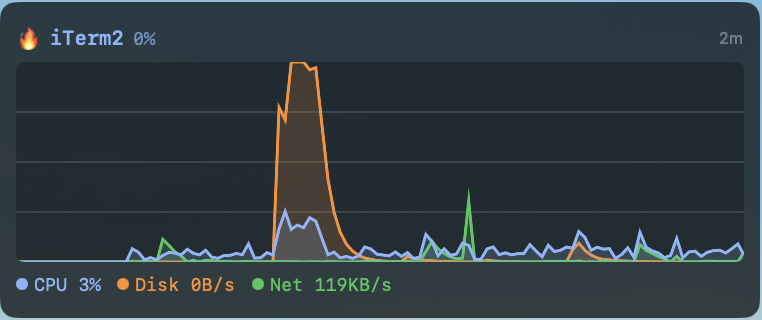
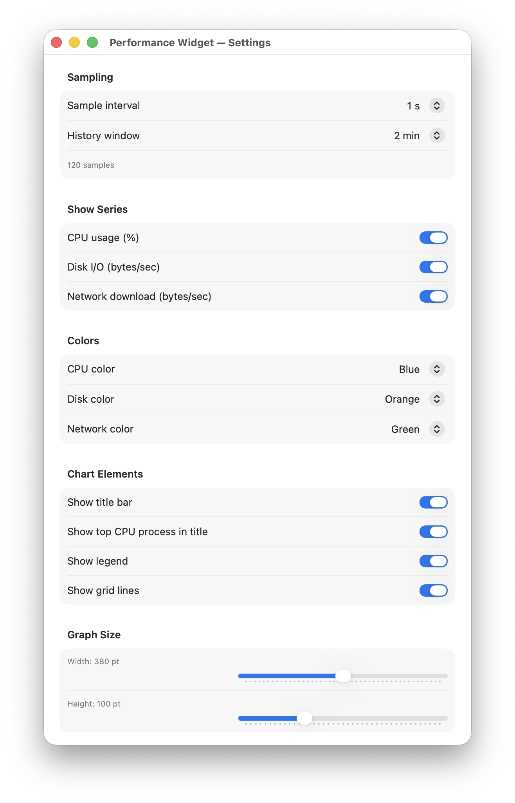
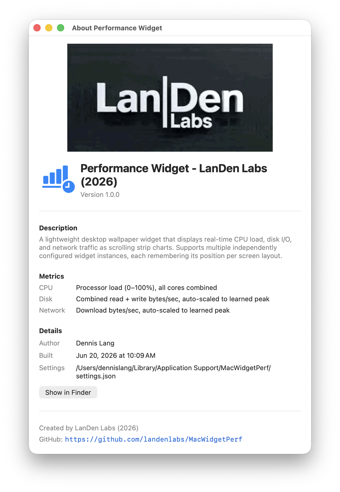

<table border="0">
  <tr>
    <td>
      <!-- VERSION -->v6.08.20
      <!-- DATE -->22-Aug-2026<br>
      macOS<br>
      <a href="https://landenlabs.com">Home</a>
    </td>
    <td>
      <a href="https://landenlabs.com">
        
      </a>
    </td>
  </tr>
</table>

# MacWidgetPerf


A lightweight, transparent **System Performance desktop widget** for macOS. Displays live CPU, disk I/O, and network activity as scrolling strip charts directly on your desktop wallpaper. Runs as a borderless overlay with no Dock icon — just the data, always visible.

**By [LanDen Labs](https://github.com/landenlabs) (2026)**

---

## Screenshots

**Widget on desktop — scrolling strip chart**


**Widget settings — sampling, colors, and chart options**



**About dialog**



---

## Features

- **Live performance charts** — CPU usage, disk I/O, and network download as overlapping scrolling strip charts
- **Top CPU process** — title bar shows the busiest process name and its CPU % over the history window
- **Auto-scaling axes** — disk and network peaks are learned and slowly decay so the chart always uses the full height
- **EMA smoothing** — exponential moving average removes jitter while keeping the chart responsive
- **Transparent overlay** — sits directly on the desktop wallpaper, no Dock icon or taskbar clutter
- **Per-screen position memory** — widget remembers its position for every monitor layout
- **Drag to reposition** — move the widget via the status bar menu's drag mode
- **Configurable history window** — 30 s to 10 min of rolling history
- **Configurable sample interval** — 0.5 s, 1 s, 2 s, or 5 s
- **Per-series color selection** — choose from 8 colors for CPU, disk, and network
- **Toggle series** — show or hide CPU, disk, and network independently
- **Resizable graph** — width 160–600 pt, height 40–240 pt via sliders
- **Grid lines** — optional horizontal reference lines
- **Adjustable background opacity** — 0–70 % semi-transparent backing panel
- **Launch at Login** — optional macOS login item via System Events

---

## Requirements

- macOS 13 (Ventura) or later
- Swift 5.9 / Xcode 15 or later (to build from source)

---

## Installation

### Build from source

```bash
git clone https://github.com/landenlabs/mac-widget-perf.git
cd mac-widget-perf
swift build -c release
```

The built binary is at:
```
.build/release/MacWidgetPerf
```

Run it directly or copy it to `/Applications` or any location in your `PATH`.

---

## Usage

The app runs as a **menu bar accessory** — no Dock icon. After launch, look for the chart icon in the menu bar.

### Status bar menu

| Item | Action |
|------|--------|
| **Move Widget…** | Enables drag mode — drag the widget anywhere on the desktop, click again to lock |
| **Settings… ⌘,** | Opens the Settings window |
| **Launch at Login** | Toggles automatic startup at login |
| **Quit ⌘Q** | Quits the app |

---

## Settings

Open Settings via **Settings… (⌘,)** in the status bar menu.

### Sampling

| Field | Description |
|-------|-------------|
| Sample interval | How often the widget polls the system: 0.5 s / 1 s / 2 s / 5 s |
| History window | Rolling time range displayed: 30 s / 1 min / 2 min / 5 min / 10 min |

### Show Series

| Toggle | Description |
|--------|-------------|
| CPU usage (%) | Overlay the CPU utilization series |
| Disk I/O (bytes/sec) | Overlay combined disk read + write throughput |
| Network download (bytes/sec) | Overlay inbound network throughput |

### Colors

Assign one of eight colors (Green, Cyan, Blue, Orange, Yellow, White, Red, Pink) to each series independently.

### Chart Elements

| Toggle | Description |
|--------|-------------|
| Show title bar | Display the header row above the chart |
| Show top CPU process in title | Replace the generic header with the busiest process name + % |
| Show legend | Display the live-value legend row below the chart |
| Show grid lines | Horizontal reference lines across the chart |

### Graph Size

| Control | Range | Description |
|---------|-------|-------------|
| Width slider | 160–600 pt | Horizontal size of the chart area |
| Height slider | 40–240 pt | Vertical size of the chart area |

### Appearance

| Control | Range | Description |
|---------|-------|-------------|
| Background opacity | 0–70 % | Translucency of the backing rounded rectangle |

Settings are saved automatically to:
```
~/Library/Application Support/MacWidgetPerf/settings.json
```

---

## Building from Source

### Prerequisites

- macOS 13+
- Swift 5.9+ (ships with Xcode 15+) or standalone Swift toolchain

### Build (debug)

```bash
swift build
```

### Build (release)

```bash
swift build -c release
```

### Run directly

```bash
swift run
```

---

## Project Structure

```
mac-widget-perf/
├── Sources/MacWidgetPerf/
│   ├── main.swift              # Entry point
│   ├── AppDelegate.swift       # Menu bar, window lifecycle
│   ├── AppSettings.swift       # Observable state, JSON persistence
│   ├── WidgetConfig.swift      # Per-widget model, colors, screen fingerprinting
│   ├── ContentView.swift       # SwiftUI widget renderer (title + chart + legend)
│   ├── StripChartView.swift    # Scrolling strip chart with multiple overlaid series
│   ├── PerfMonitor.swift       # CPU (Mach), disk (IOKit), network (getifaddrs) sampling
│   ├── ProcessCpuMonitor.swift # Per-process CPU tracking for top-process display
│   ├── NetworkMaxStore.swift   # Persistent learned network peak across launches
│   ├── WidgetWindowManager.swift # Borderless desktop window, drag mode
│   ├── DragOverlayView.swift   # AppKit mouse-event capture for repositioning
│   ├── SettingsView.swift      # Settings window (grouped form)
│   ├── AboutView.swift         # About dialog
│   ├── Version.swift           # App version constant
│   └── Resources/              # Bundled assets
├── screens/                    # Screenshot assets for README
├── Package.swift
└── README.md
```

---

## Settings File Format

```json
{
  "configs": [
    {
      "id": "550e8400-e29b-41d4-a716-446655440000",
      "sampleInterval": 1.0,
      "historySeconds": 120.0,
      "graphWidth": 320.0,
      "graphHeight": 100.0,
      "backgroundOpacity": 0.15,
      "showCpu": true,
      "showDisk": true,
      "showNetwork": true,
      "showTitle": true,
      "showLegend": true,
      "showGrid": true,
      "showTopProcess": true,
      "cpuColor": "Blue",
      "diskColor": "Orange",
      "networkColor": "Green",
      "positionX": 40.0,
      "positionY": 400.0,
      "screenPositions": {
        "2560x1440@0,0": { "x": 40, "y": 400 }
      }
    }
  ]
}
```

---

## Credits

| Component | Source |
|-----------|--------|
| CPU sampling | Mach `host_processor_info` |
| Disk I/O sampling | IOKit `IOBlockStorageDriver` statistics |
| Network sampling | POSIX `getifaddrs` + `if_data` |
| Per-process CPU | `/proc`-style `host_processor_info` via `ProcessCpuMonitor` |

---

## License

Apache © [LanDen Labs](https://github.com/landenlabs) 2026
